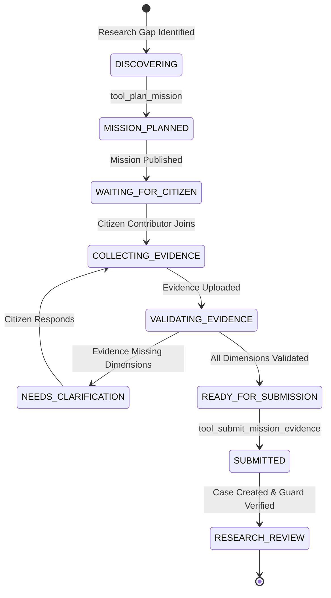

# 🤖 StreamSignal — Evidence Mission Agent Architecture

---

## 🧭 Executive Summary for Hackathon Judges

Most hackathon "AI agents" are brittle prompt wrappers: a generic chatbot prompted to "act like an expert" that hallucinates chemical parameters, invents diagnostic claims ("the water is 94% toxic"), and allows prompt injections to hijack backend tools.

**StreamSignal's Evidence Mission Agent is fundamentally different.**

It is an **autonomous, bounded, state-machine-driven orchestrator** designed specifically for scientific evidence collection in urban freshwater ecosystems:

1. **Bounded State Machine ($S_0 \to S_7$)**: The agent cannot skip states or invent arbitrary actions. All state transitions are mathematically governed by Python code, not prompt compliance.
2. **Tool Execution Firewall (`ALLOWED_AGENT_TOOLS`)**: Strict allowlist preventing prompt injection or arbitrary database/tool access. External user strings are treated strictly as untrusted observation data.
3. **StreamSignal One Health Evidence Model ($E_1$ to $E_5$)**: Strict ontological separation between Citizen Evidence ($E_1, E_2$), Machine Assistance ($E_3$), Corroboration ($E_4$), and Human Decision ($E_5$). The agent **never** claims causation or diagnoses human illness.
4. **Local-First & Zero-Cost Execution**: Runs locally using **Ollama** with JSON Schema-constrained generation (`llama3.2`) with an authoritative **Deterministic Rule Provider** fallback. Operates 100% offline without paid API keys.
5. **Immutable Cryptographic Audit Trail**: Every prompt, tool invocation, and decision is recorded in the PostgreSQL `agent_action_audits` table with microsecond timestamps and input/output snapshots.
6. **FHIR R4 Interoperability Hand-Off**: Once validated, collected evidence seamlessly hands off to the existing `Report` $\to$ `SignalCase` $\to$ `SignalGuard` $\to$ `EvidencePassport` $\to$ **FHIR R4 Provenance Gateway** pipeline.

---

## 🏛️ System Architecture

```
                                  +------------------------------------+
                                  |    Research Workspace / Case Gaps  |
                                  +-----------------+------------------+
                                                    |
                                                    v
                                    [ tool_get_evidence_gap ]
                                                    |
                                                    v
                                      [ tool_plan_mission ]
                                                    |
                                                    v
+---------------------------------------------------------------------------------------------------+
| EVIDENCE MISSION AGENT RUNTIME (backend/app/agent/)                                               |
|                                                                                                   |
|  +--------------------+     +---------------------------+     +--------------------------------+  |
|  |  Mission Registry  |     |   Bounded State Machine   |     |    Model Provider Factory      |  |
|  |  (Allowlisted      |     |   (Enforced Transition    |     |    (Local Ollama JSON Schema   |  |
|  |   Templates Only)  |     |    Firewall S0 -> S7)     |     |     or Deterministic Fallback) |  |
|  +---------+----------+     +-------------+-------------+     +---------------+----------------+  |
|            |                              |                                   |                   |
|            +------------------------------+-----------------------------------+                   |
|                                           |                                                       |
|                                           v                                                       |
|                         [ TOOL EXECUTION FIREWALL ]                                               |
|                         Assert tool in ALLOWED_AGENT_TOOLS                                        |
|                         (get_gap, plan, start, validate, submit)                                  |
|                                           |                                                       |
|                                           v                                                       |
|                         [ IMMUTABLE AGENT AUDIT LOG ]                                             |
|                         Persists (mission_id, action, context, timestamp)                         |
+-------------------------------------------+-------------------------------------------------------+
                                            |
                                            v
                               +-------------------------+
                               | Citizen Contributor App |
                               | (Guided Step-by-Step)   |
                               +------------+------------+
                                            |
                                            v
                               +-------------------------+
                               |  tool_submit_evidence   |
                               +------------+------------+
                                            |
                                            v
+---------------------------------------------------------------------------------------------------+
| EXISTING STREAM SIGNAL EVIDENCE ENGINE                                                            |
|                                                                                                   |
|   Report  -->  SignalCase  -->  SignalGuard (Trust Contract)  -->  FHIR R4 Provenance Gateway     |
+---------------------------------------------------------------------------------------------------+
```

---

## 🔄 Bounded State Machine

The agent enforces a strict Finite State Machine. Neither the frontend nor an LLM can bypass states or prematurely submit incomplete evidence.



### Transition Enforcement Matrix

| Current State | Permitted Next States | Rejection Behavior |
|---|---|---|
| `DISCOVERING` | `MISSION_PLANNED` | HTTP 400 Bad Request |
| `MISSION_PLANNED` | `WAITING_FOR_CITIZEN` | HTTP 400 Bad Request |
| `WAITING_FOR_CITIZEN` | `COLLECTING_EVIDENCE` | HTTP 400 Bad Request |
| `COLLECTING_EVIDENCE` | `VALIDATING_EVIDENCE` | HTTP 400 Bad Request |
| `VALIDATING_EVIDENCE` | `NEEDS_CLARIFICATION`, `READY_FOR_SUBMISSION`, `COLLECTING_EVIDENCE` | HTTP 400 Bad Request |
| `NEEDS_CLARIFICATION` | `COLLECTING_EVIDENCE`, `VALIDATING_EVIDENCE` | HTTP 400 Bad Request |
| `READY_FOR_SUBMISSION`| `SUBMITTED`, `COLLECTING_EVIDENCE` | HTTP 400 Bad Request |
| `SUBMITTED` | `RESEARCH_REVIEW` | Terminal state for citizen loop |

---

## 🛡️ Tool Execution Firewall & Security

To prevent prompt injections and jailbreaks from manipulating the system:

```python
# app/agent/tools.py
ALLOWED_AGENT_TOOLS = {
    "get_evidence_gap",
    "plan_mission",
    "get_mission",
    "start_mission",
    "validate_evidence",
    "submit_mission_evidence",
    "list_approved_mission_needs",  # Issue 17: Read-only access to researcher-approved needs
}
```

### 🔬 Issue 17: Researcher Authority Boundary & Mission Needs

The Evidence Mission Agent cannot unilaterally decide research priorities:

1. **Evidence Gap Intelligence** analyzes real PostgreSQL SignalCases to discover recurring missing dimensions.
2. **Researchers Author Mission Needs** with mandatory substantive scientific rationale (placeholders rejected).
3. **Researcher Approval Gate**: Needs progress through `IDENTIFIED` $\to$ `REVIEWED` $\to$ `APPROVED`.
4. **Agent Read-Only Access**: The agent can only see `APPROVED` needs (`tool_list_approved_mission_needs`). It has zero permission to create, approve, or close needs.
5. **Traceable Provenance**: When `tool_plan_mission` executes, it links the mission to the originating `mission_need_id`, establishing complete traceability from citizen contribution $\to$ mission $\to$ researcher need $\to$ empirical evidence gap.

def assert_tool_allowed(tool_name: str) -> None:
    if tool_name not in ALLOWED_AGENT_TOOLS:
        raise HTTPException(
            status_code=400,
            detail=f"AGENT_ACTION_NOT_ALLOWED: Tool '{tool_name}' is not authorized."
        )
```

### Safety Contracts:
1. **No Arbitrary Tool Execution**: The agent cannot call system shells, run arbitrary SQL, or access files outside designated upload paths.
2. **Input Sanitization**: Citizen inputs (text observations, comments) are treated strictly as untrusted observation data. They are never evaluated as agent instructions.
3. **No Environmental Diagnosis**: The agent cannot claim that water is "toxic" or "polluted". It can only report observed cues (e.g., "apparent water clarity: greenish", "odor: earthy", "foam present: yes").
4. **Idempotent Case Creation**: `submit_mission_evidence` checks if a `SignalCase` is already linked to prevent duplicate submissions on network retries.

---

## 🧬 StreamSignal One Health Evidence Model ($E_1$ to $E_5$)

The agent operates strictly under the StreamSignal Evidence Model:

```
[E1: REPORTED]                   Citizen text report or initial observation
      |
[E2: OBSERVED / DOCUMENTED]      Geotagged photo, flow condition, visual cue
      |
[E3: INFERRED]                   Machine-assisted visual cue segmentation
      |
[E4: CONTEXTUALLY CORROBORATED]  Pattern Echo, rainfall correlation, historical sensor context
      |
[E5: VERIFIED]                   Authorized researcher human review outcome
```

> **EPISTEMIC BOUNDARY**: Evidence classes ($E_1$ to $E_5$) represent **provenance and epistemic status**, NOT machine confidence or quality scores ($E_4$ is NOT "80% confidence" and $E_5$ is NOT "100% AI confidence").
>
> **CRITICAL RULE**: $E_4 \ne E_5$. Contextual pattern correlation is **never** conflated with human scientific confirmation. The agent coordinates evidence through $E_1 \to E_2 \to E_4$; only authorized human reviewers can sign off on $E_5$.

---

## 🧠 Local-First Dual Model Provider (`app/agent/providers.py`)

Judges can run and verify StreamSignal without any paid API keys or cloud dependencies:

1. **Ollama Provider (`OllamaProvider`)**:
   - Sends requests to local Ollama daemon (`http://localhost:11434`).
   - Uses **JSON Schema-constrained output** (`MissionAgentAction.model_json_schema()`), forcing the local LLM to output valid JSON matching our Pydantic contract.
2. **Deterministic Rule Provider (`DeterministicRuleProvider`)**:
   - Zero-dependency rule-based reasoning engine.
   - Evaluates collected vs. required evidence dimensions directly.
   - Acts as the automatic, bulletproof fallback if Ollama is not installed or offline.
   - Guarantees 100% test repeatability in CI/CD pipelines.

---

## 📂 File-by-File Code Map

| File | Purpose | Responsibility |
|---|---|---|
| [`registry.py`](./registry.py) | **Allowlisted Mission Templates** | Curated catalog of scientifically grounded missions (`AFTER_RAIN_STREAM_CHECK`, `EVIDENCE_CLARIFICATION`, `PLACE_EVIDENCE_SNAPSHOT`). Prevents arbitrary mission invention. |
| [`state_machine.py`](./state_machine.py) | **Finite State Machine** | Mathematically enforces valid transitions ($S_0 \to S_7$). Rejects illegal jumps with HTTP 400. |
| [`providers.py`](./providers.py) | **Model Provider Abstraction** | Pluggable reasoning layer: Ollama (local JSON schema) + Gemini + Deterministic Rule Engine fallback. |
| [`tools.py`](./tools.py) | **Execution Firewall & Tools** | The 5 approved agent tools with strict parameter validation and PostgreSQL persistence. |
| [`orchestrator.py`](./orchestrator.py) | **Evidence Mission Agent** | High-level coordinator linking research evidence gaps to citizen mission execution. |
| [`__init__.py`](./__init__.py) | **Package Export** | Public API surface for the agent package. |

---

## 🎯 Alignment with IEEE OneAquaHealth Hackathon Evaluation Criteria

| Hackathon Criterion | How StreamSignal Evidence Mission Agent Delivers |
|---|---|
| **Scientific Rigor & One Health Relevance** | Evidence gap-driven missions target specific missing physical dimensions (flow rate, water clarity, foam) to augment longitudinal ecological monitoring. |
| **Safety & Ethical AI** | The agent cannot hallucinate medical or environmental claims. Strict state machine boundaries prevent autonomous runaway behavior. |
| **Interoperability (Track 7)** | Missions feed into FHIR R4 resources (`Observation`, `Media`, `Task`, `Provenance`) ready for health and environmental data exchange. |
| **Zero-Cost & Open Science** | Designed to run completely on open-source, local infrastructure (PostgreSQL + PostGIS + pgvector + Ollama) without commercial API lock-in. |
| **Real Provenance** | Immutable audit log records every agent decision, citizen contribution, and evidence transformation. |
